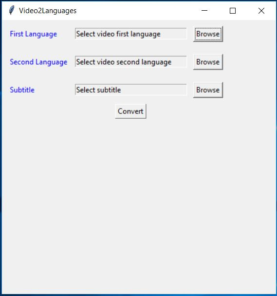

Two-language video editor that break videos into short parts and put them together in the way that 2 languages are played alternately.

### Steps:

 1. Clone or download this github respiratory (https://github.com/thadaJ/Two-language-video-editor-for-studying-foreign-language) to your computer
 2. Open the application '.\Video2Languages\Video2Languages.exe'
 3. Add a first language (e.g. Chinese, Thai, etc) mp4  video
 4. Add a second language (e.g. English, etc) mp4 video
 5. Add a subtitle (.srt)
 6. Click 'Convert'
 7. Wait until the process is done
 8. Open the folder '.\Video2Languages\output_video' to see the output video
 9. Play and enjoy the video in the output folder 

if you think this program is beneficial for you and would like to donate to support my work, please click the following button.

Or donate me via Alipay.

